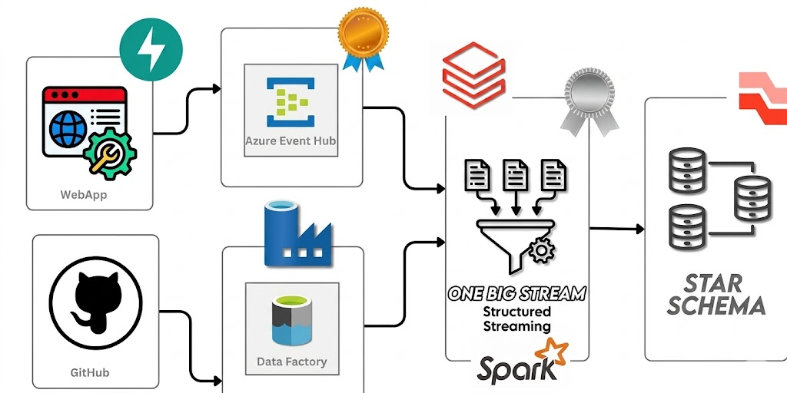
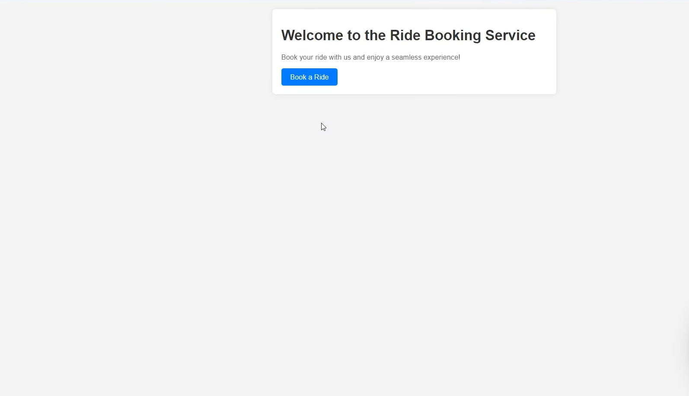
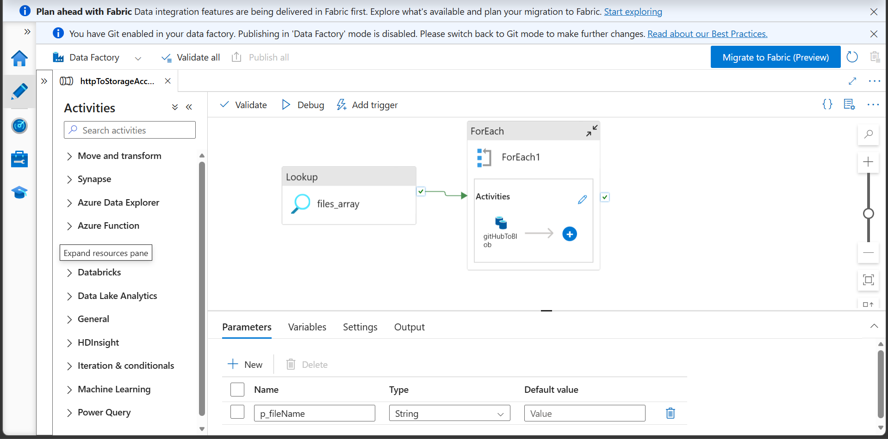
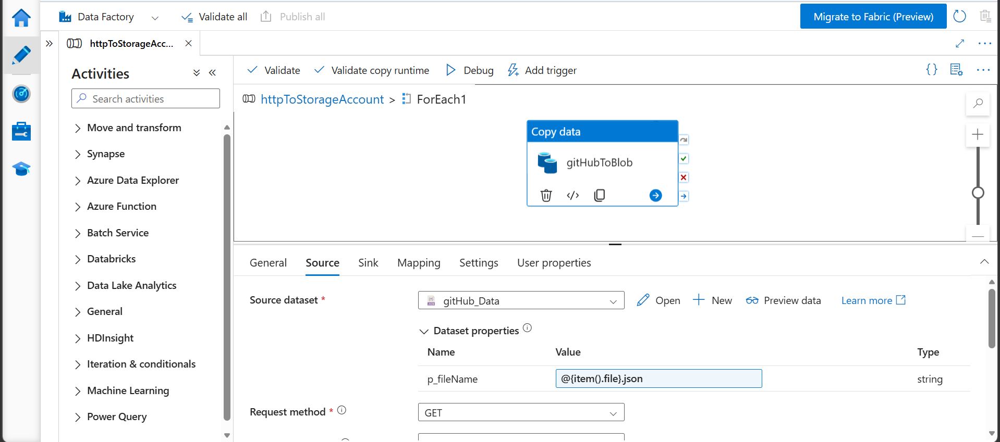
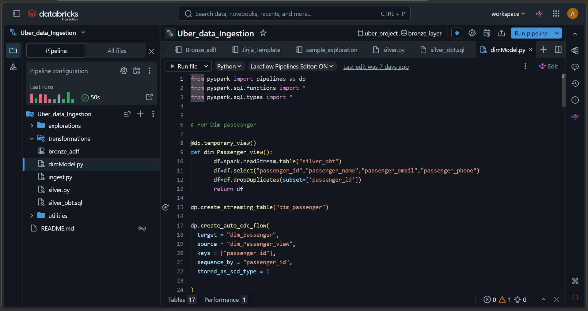
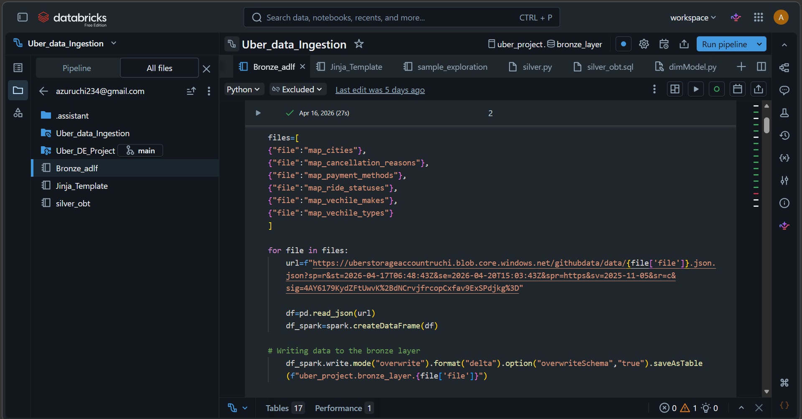
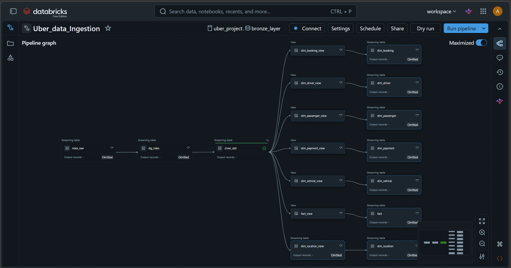

# 🚖 Uber End-to-End Real-Time Data Engineering Pipeline
This project demonstrates a production-grade Modern Data Lakehouse architecture built on Microsoft Azure. It orchestrates a hybrid data flow—combining real-time streaming data from an Uber Ride Booking Application with historical batch data—processed through a Medallion Architecture (Bronze-Silver-Gold) using Databricks and Spark Declarative Pipelines (DLT).

# 🏗 Architecture Diagram
The pipeline follows a robust flow: 
**Event Hub/GitHub ➡️ Azure Data Factory ➡️ ADLS Gen2 ➡️ Azure Databricks (DLT) ➡️ Gold Tables**

# 🛠 Tech Stack
* **Cloud Provider:** Microsoft Azure
* **Ingestion:** Azure Event Hubs (Streaming), Azure Data Factory (Batch)
* **Data Lake:** Azure Data Lake Storage (ADLS) Gen2
* **Processing:** Azure Databricks (PySpark, Spark Declarative Pipelines)
* **Orchestration:** ADF Metadata-driven Pipelines
* **Formatting:** Jinja2 Templating for Dynamic SQL

# 🚀 Key Implementation Phases

1. ## Real-Time Ingestion (Event Hubs)
I built a custom Python application that simulates an Uber ride booking UI. When a user clicks "Book a Ride," the event is captured and pushed to Azure Event Hubs (uber-eventhub-pro) under the topic ubertopic.

* **Security:** Implemented Shared Access Policies (SAS) for secure Send/Listen permissions.

* **Connectivity:** Used AMQP over WebSockets in the Python application to bypass corporate firewalls.

2. ## Metadata-Driven Batch Ingestion (ADF)
To handle historical data and mapping files (Cities, Cancellation reasons, etc.) stored in GitHub, I built a Generic Metadata-Driven Pipeline in ADF.

* **Automation:** Instead of hardcoding filenames, I used a Lookup Activity to fetch file lists and a For-Each Loop to dynamically ingest data into the Bronze container.

* **Parameters:** Utilized ADF parameters to make the pipeline reusable for any new dataset.

3. ## The Medallion Processing (Databricks & DLT)
I implemented the processing logic using Spark Declarative Pipelines (DP) to ensure data reliability and schema enforcement.

### Bronze Layer (Raw)
* Connected Databricks to Event Hubs using the Listen policy.

* Created rides_raw as a streaming table to ingest real-time events.

* Loaded historical bulk_rides from ADLS Gen2 using SAS tokens.

### 🥈 Silver Layer (Enriched & Unified)
* **Schema Enforcement:** Transformed raw events to match the historical schema and merged them into a unified stg_rides streaming table.

* **Jinja2 Templating:** Used Jinja2 to write dynamic SQL joins for mapping tables. This ensures that adding new mapping tables doesn't require rewriting the code—only updating the config file.

* **Streaming Joins:** Performed stateful streaming-to-batch joins to create the Silver One Big Table (OBT).

### 🥇 Gold Layer (Data Modeling)
Transformed the OBT into a Star Schema for analytical reporting:

* **Fact Table:** fact_rides (Metrics: fare, distance, duration).

* **Dimension Tables:** dim_passenger, dim_driver, dim_payment, dim_booking.

* SCD Type 2: Implemented Slowly Changing Dimension (Type 2) for dim_location to track historical changes in city/region boundaries over time.

##  Orchestration & Efficiency
* **Watermarking:** Applied watermarking techniques in Spark Structured Streaming to handle late-arriving data and manage state memory.
* **Scheduling:** Orchestrated the entire workflow with **ADF Triggers** and Databricks Jobs running every 15 minutes.

